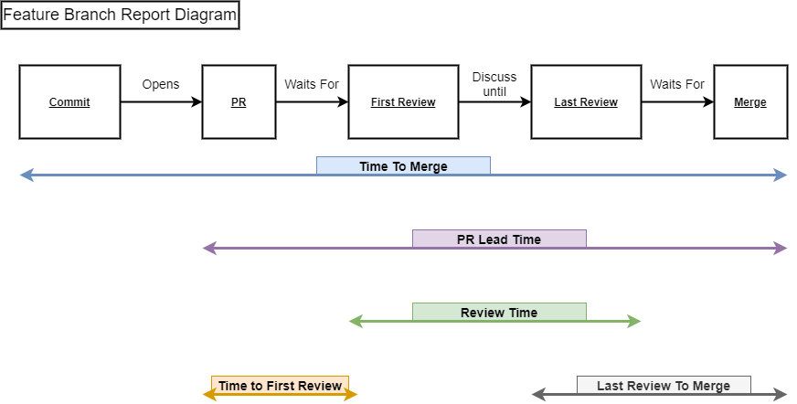
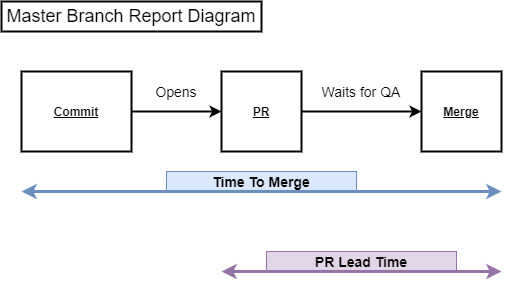

# MKPIS Modifications for GSM Usage


### Modifications Include:
- Converting duration format
- Added Export to CSV using Excelize Package
- Routed CSV To Power BI Report for consumption
- Added YAML build to test Github Token Configuration

## How To Run
- Go to [https://github.com/ZackAllen1/mkpis](https://github.com/ZackAllen1/mkpis)
- Click on the Green Code button and click Download ZIP
- Unzip the file and open the folder in an IDE that can run Go code (Ex: VSCode)
  * If using VSCode, upon opening the file you can install the Go Extension 
- Change the directory to the following using the Terminal
  ```
  somepath\mkpis\cmd\cli
  ```
- Create a file called .env in this directory and add the following code
  ```
  GITHUB_TOKEN= <Your Token Here>
  DEVELOP_BRANCH_NAME= <Feature Branch Name> 
  MASTER_BRANCH_NAME= <Master Branch Name>
  ```
- To get the GITHUB_TOKEN, do the following steps:
  * Go to [https://github.com/settings/tokens](https://github.com/settings/tokens)
  * Click Generate New Token
  * Set an Expiration Date (Note: you will have to repeat this process to regenerate the token after the expiration date)
  * Check all of the checkboxes and click the Green Generate Token Button
  * Copy the token that was created and replace ```<Your Token Here>``` with the token you just created

- ```<Feature Branch Name>``` generates the following data about the branch
  
- Wheras ```<Master Branch Name>``` generates the following data about the branch
  


- Save the .env file
- Open the terminal again (making sure the end of the path is ```mkpis\cmd\cli```) and use the following command
  ```
  go run main.go -owner GlobalSafetyManagement -repo <RepoName> -from "YYYY-MM-DD" -to "YYYY-MM-DD"
  ```
  * ```<RepoName>``` can be any repository within GlobalSafetyManagement (Ex: SDS-Application, AutoSDS, etc.)
  * ```-from``` is the start date of the report and ```-to``` is the end date of the report
- Example
  ```
  go run main.go -owner GlobalSafetyManagement -repo SDS-Application -from "2021-05-01" -to "2021-07-30"
  ```
  * Will run the report on SDS-Application from May 1st 2021 to July 30th 2021
- Once you run the command a file called ```GithubBranchReport.xlsx``` will be created
  * This file is what will be used in the Power BI Report


## Importing to Power BI
- Open the GSM Workspace on the Power BI Website
- Click on the GithubPRTracker Report
- Click File > Download the .pbix File
- Open Power BI Desktop and load the .pbix File you just downloaded
- On the Home bar click the drop down arrow on "Transform Data", then click "Data Source Settings"
- Make sure "Data sources in current file" is selected, then "Change Source" to the path of ```GithubBranchReport.xlsx``` that was created on your desktop
- Close then Refresh, and the data should update
- Now anytime you run the ```go run main.go``` command from above, all you have to do is refresh the Power BI data and "Publish" your reports for everyone to see


## END OF NOTES

See [original repo](https://github.com/jmartin82/mkpis) for more details/calculations


## Limitations

* Currently this application only work in github repos.
* This project is useless if your team is working in a Trunk Base development.


## Licence

Copyright © 2020, Jordi Martín (http://jordi.io)

Released under MIT license, see LICENSE for details.

